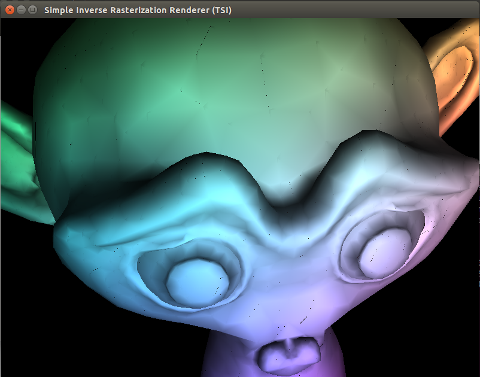

# 3D-Rendering-Engine
A 3D Rendering project made in team with Java, during my 2nd year at the ENSEEIHT.
My project teammate was Maxime PESCHARD.
We didn't write the whole code, but we had to implement several methods in the program.

To launch the rendering engine :
* select a scene in the data directory (for example, data/example2.scene)
* type `java Renderer data/example2.scene`

